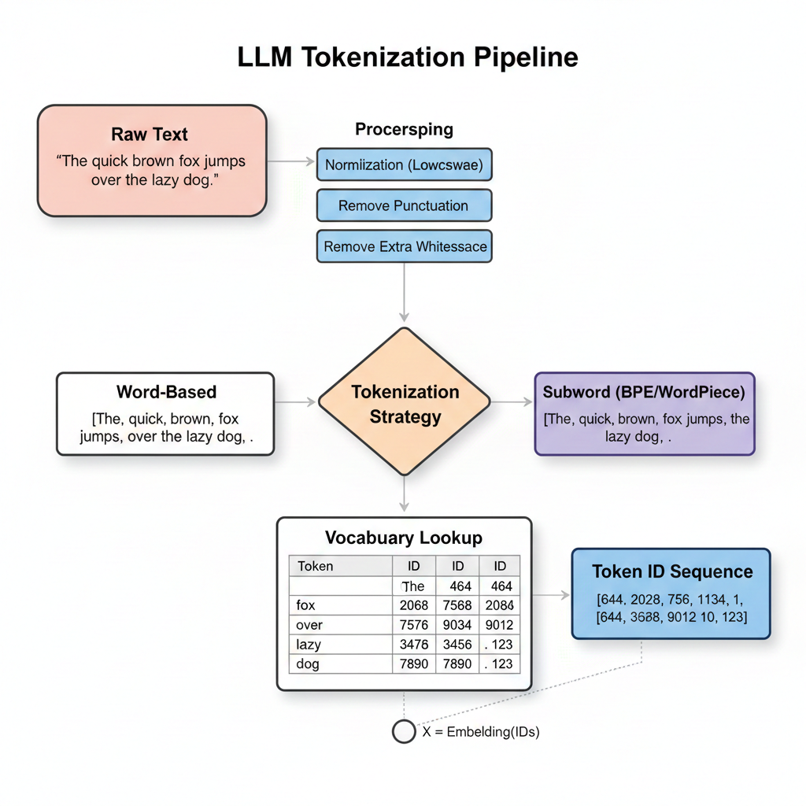

# 🧠 Tokenization Algorithms in Large Language Models

Tokenization algorithms determine **how raw text is segmented into tokens** and how those tokens are selected for the model vocabulary.

Modern LLMs rely on **subword tokenization** to balance:

* Vocabulary size
* Sequence length
* Generalization
* Multilingual coverage

> **Key idea:**
> Tokenization algorithms compress language into statistically meaningful units that a model can efficiently learn.

---

## 1️⃣ Why Subword Tokenization?

Word-level tokenization leads to:

* Extremely large vocabularies
* Out-of-vocabulary (OOV) errors
* Poor handling of rare and compound words

Character-level tokenization leads to:

* Very long sequences
* Weak semantic signals
* Inefficient training

**Subword tokenization solves both problems** by decomposing rare words while keeping common patterns intact.

---

## 2️⃣ Overview of Tokenization Algorithms

| Algorithm                | Core Principle                | Used By    |
| ------------------------ | ----------------------------- | ---------- |
| Byte Pair Encoding (BPE) | Frequency-based merging       | GPT family |
| WordPiece                | Likelihood maximization       | BERT       |
| Unigram Language Model   | Probabilistic token selection | LLaMA, T5  |
| Byte-level Tokenization  | Tokenize raw bytes            | GPT-2+     |

---

## 3️⃣ Byte Pair Encoding (BPE)

### What is BPE?

**Byte Pair Encoding** is a **deterministic, frequency-based** tokenization algorithm.

It works by:

1. Starting with characters (or bytes)
2. Repeatedly merging the most frequent adjacent token pairs
3. Stopping when the target vocabulary size is reached

### Example

```
Corpus:
low lower lowest

After merges:
["low", "er", "est"]
```

### When to Use BPE

**Strengths**

* Simple and fast
* Efficient compression
* Strong performance for English and programming code

**Limitations**

* Frequency-based only (no probabilistic modeling)
* Less flexible for morphologically rich languages

📌 **Used in:** GPT-2, GPT-3, GPT-4 (byte-level BPE)

---

## 4️⃣ WordPiece

### What is WordPiece?

WordPiece is similar to BPE but differs in how merges are selected.

Instead of frequency, WordPiece:

* Chooses token splits that **maximize likelihood**
* Optimizes how well the tokens explain the training corpus

### Example

```
unbreakable
→ un ##break ##able
```

The `##` prefix indicates continuation of a word.

### Strengths & Limitations

**Strengths**

* More linguistically consistent splits
* Better probabilistic modeling than BPE

**Limitations**

* More complex training
* Slightly slower than BPE

📌 **Used in:** BERT, DistilBERT, ALBERT

---

## 5️⃣ Unigram Language Model (SentencePiece)

### What is Unigram LM Tokenization?

Unigram tokenization takes a **top-down probabilistic approach**:

* Start with a large candidate vocabulary
* Assign probabilities to tokens
* Iteratively remove tokens that contribute least to likelihood

The final vocabulary maximizes:

```
P(text | tokens)
```

### Example

```
"unbelievable"

Possible segmentations:
["un","believable"]
["unbeliev","able"]
["un","bel","iev","able"]

→ Highest-probability segmentation is selected
```

### Why It’s Important

**Strengths**

* Flexible token boundaries
* Excellent multilingual performance
* Robust to rare and unseen words

**Limitations**

* Slower training
* More complex inference

📌 **Used in:** LLaMA, T5, SentencePiece-based models

---

## 6️⃣ Byte-Level Tokenization

### What is Byte-Level Tokenization?

Instead of characters or words:

* Text is first converted into raw **UTF-8 bytes (0–255)**
* Tokenization is applied at the byte level

### Example

```
😀 → [240, 159, 152, 128]
```

### Why Byte-Level Matters

**Strengths**

* No unknown tokens
* Handles emojis, symbols, code, and binary data
* Language-agnostic

**Limitations**

* Can increase token count for some text
* Less human-readable token splits

📌 **Used in:** GPT-2+, GPT-3, GPT-4

---

## 7️⃣ Minimal Diagram: Algorithm Flow (Where It Helps)



(Additional diagrams are unnecessary once the core concept is understood.)

---

## 8️⃣ Comparison Summary

| Feature              | BPE | WordPiece | Unigram LM | Byte-level |
| -------------------- | --- | --------- | ---------- | ---------- |
| Deterministic        | ✅   | ❌         | ❌          | ✅          |
| Probabilistic        | ❌   | ✅         | ✅          | ❌          |
| Handles OOV          | ⚠️  | ⚠️        | ⚠️         | ✅          |
| Multilingual         | ⚠️  | ⚠️        | ✅          | ✅          |
| Code & Emoji Support | ✅   | ⚠️        | ⚠️         | ✅          |

---

## 9️⃣ Why This Choice Matters in LLMs

The tokenization algorithm directly influences:

* Token count per input
* Context window usage
* API cost
* Multilingual bias
* Model reasoning behavior

> **Tokenization is a core architectural decision, not a preprocessing step.**

---

## 🔑 Key Takeaways

* All modern LLMs use subword or byte-level tokenization
* BPE is fast and efficient
* WordPiece adds probabilistic rigor
* Unigram LM offers flexibility and multilingual strength
* Byte-level tokenization eliminates unknown tokens entirely

---
