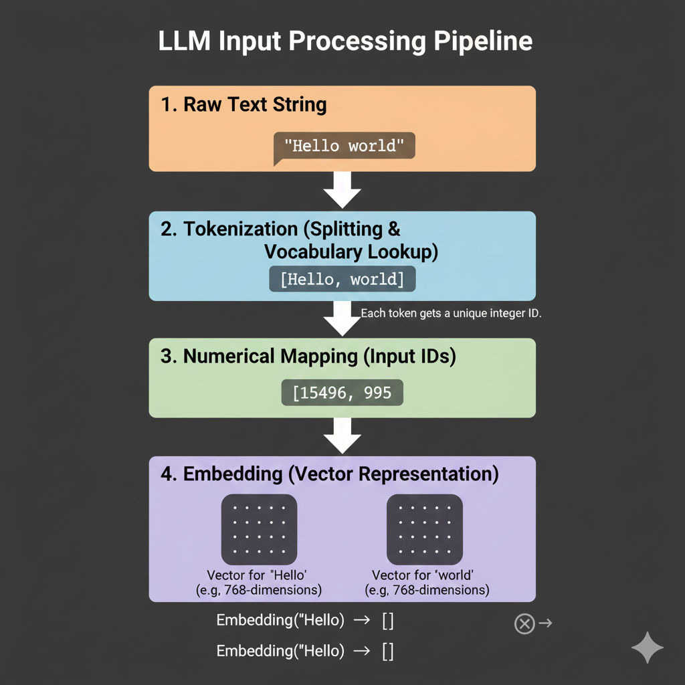

# 🔄 Tokenization Pipeline in Large Language Models

The **tokenization pipeline** defines the **exact sequence of transformations** that convert raw text into numerical representations usable by an LLM.

> **Key idea:**
> The model never sees text — it only sees numbers produced by this pipeline.

---

## 1️⃣ High-Level Pipeline Overview

```
Text
  ↓
Normalization
  ↓
Pre-tokenization
  ↓
Subword Encoding
  ↓
Token IDs
  ↓
Embeddings
```

Each stage is **deterministic**, reproducible, and critical to model behavior.

---

## 2️⃣ Stage 1: Text Normalization

### What Happens Here?

Text normalization ensures **consistent and clean input** before token splitting.

Common operations:

* Unicode normalization (NFKC / NFC)
* Standardizing whitespace
* Handling punctuation
* Case normalization (model-dependent)

### Example

```
Input:
“Hello   WORLD!”

After normalization:
"Hello WORLD!"
```

📌 **Why it matters**

* Prevents duplicate token forms
* Reduces vocabulary fragmentation
* Improves training efficiency

---

## 3️⃣ Stage 2: Pre-tokenization

### Purpose

Pre-tokenization splits text into **coarse-grained units** before subword encoding.

Typical boundaries:

* Whitespace
* Punctuation
* Special characters

### Example

```
Input:
"Tokenization, at scale!"

Pre-tokenized:
["Tokenization", ",", "at", "scale", "!"]
```

📌 This stage **does not decide final tokens** — it only prepares candidates.

---

## 4️⃣ Stage 3: Subword Encoding

### What Happens Here?

Pre-tokenized chunks are further broken down using:

* BPE
* WordPiece
* Unigram LM
* Byte-level encoding

The goal is to:

* Preserve frequent patterns
* Decompose rare words
* Minimize vocabulary size

### Example

```
"unhappiness"
→ ["un", "happi", "ness"]
```

📌 This is the **most important stage** of tokenization.

---

## 5️⃣ Stage 4: Token to ID Mapping

Each final token is mapped to a **fixed integer ID** from the vocabulary.

### Example

```
Tokens:
["un", "happi", "ness"]

Token IDs:
[1532, 9841, 221]
```

📌 These IDs:

* Have no semantic meaning by themselves
* Are only indices into an embedding table

---

## 6️⃣ Stage 5: Special Tokens Injection

Special tokens are added to structure the sequence.

Common additions:

* Beginning-of-sequence (`<BOS>`)
* End-of-sequence (`<EOS>`)
* Role tokens (`<SYSTEM>`, `<USER>`, `<ASSISTANT>`)

### Example

```
<BOS> un happi ness <EOS>
```

📌 These tokens strongly influence **model behavior**.

---

## 7️⃣ Stage 6: Padding & Truncation

To support batching, sequences must have uniform length.

### Operations

* **Padding**: Add `<PAD>` tokens to shorter sequences
* **Truncation**: Cut sequences exceeding max length

### Example

```
Max length = 8

Input IDs:
[1, 1532, 9841, 221, 2]

Padded:
[1, 1532, 9841, 221, 2, 0, 0, 0]
```

---

## 8️⃣ Stage 7: Embedding Lookup

Token IDs are converted into **dense vectors** using an embedding matrix.

### Example

```
Token ID → ℝ^d
1532 → [0.21, -0.14, ..., 0.37]
```

These embeddings:

* Capture token-level semantics
* Are trainable parameters
* Are combined with positional embeddings

📌 This is where **numbers become meaning**.

---

## 9️⃣ Minimal Diagram: End-to-End Flow



---


## 🔎 Important Observations

* Tokenization is **deterministic**
* Same input → same tokens (for a fixed tokenizer)
* Small text changes can produce very different token sequences
* Token count, not character count, determines cost and limits

---

## 🧠 Why the Pipeline Matters

This pipeline determines:

* How much context fits into the model
* How prompts are interpreted
* How efficiently the model runs
* How bias and multilingual behavior emerge

> **All intelligence in LLMs emerges downstream of this pipeline.**

---

## 🔑 Key Takeaways

* Tokenization is a multi-stage process, not a single step
* Subword encoding is the core stage
* Token IDs are meaningless without embeddings
* Small pipeline choices have large downstream effects

---

