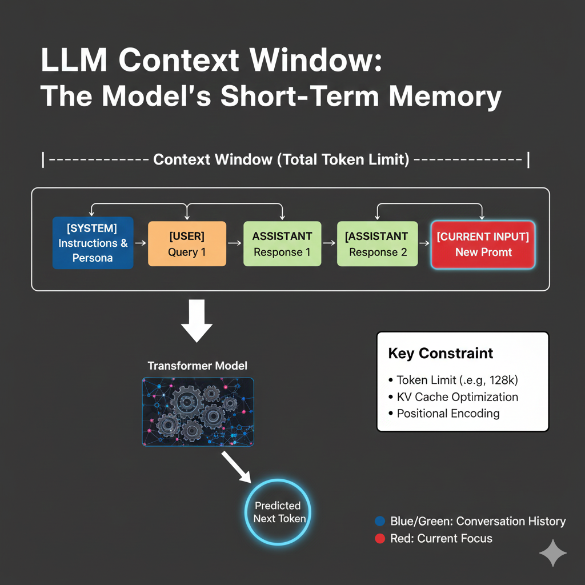

# 🧠 Context Window & Cost in Large Language Models

Large Language Models (LLMs) operate under two tightly coupled constraints:

1. A **fixed context window**
2. A **token-based pricing model**

Both are governed entirely by **token count**, not characters, words, or bytes.

> **Core principle:**
> Tokens define what the model can remember, process, and what you pay for.

---

## 1️⃣ Context Window: The Model’s Working Memory

The **context window** is the maximum number of tokens an LLM can attend to in a single forward pass.

It includes:

* System instructions
* User prompts
* Assistant responses
* Conversation history
* Special and control tokens

Once this limit is reached, the model **cannot see tokens outside the window**.

---

## 2️⃣ Context Window Is a Hard Architectural Limit

The context window is fixed at model design time and depends on:

* Positional encoding strategy
* Attention mechanism
* Memory and compute constraints

It is **not configurable by users**.

### Typical Context Sizes

| Model             | Context Length    |
| ----------------- | ----------------- |
| GPT-3.5           | ~4K tokens        |
| GPT-4             | 8K–32K tokens     |
| LLaMA-2           | 4K tokens         |
| Claude 3          | Up to 200K tokens |
| Gemini (extended) | 1M+ tokens        |

📌 Larger context windows require **significantly more compute**, often growing quadratically with token count.

---

## 3️⃣ What Exactly Consumes Context?

Every token counts, including tokens you never see.

### Components That Consume Context

* Prompt text
* Formatting (newlines, spaces)
* Role tokens (`<SYSTEM>`, `<USER>`, `<ASSISTANT>`)
* JSON / XML structure
* Model-generated responses
* Tool call metadata

Example breakdown:

```
System prompt        → 200 tokens
Conversation history → 1,500 tokens
User input           → 400 tokens
Assistant reply      → 600 tokens
---------------------------------
Total                → 2,700 tokens
```

📌 Even a short visible prompt may hide **hundreds of internal tokens**.

---

## 4️⃣ Minimal Diagram: Sliding Context Window



When the window is full:

* Oldest tokens are truncated first
* The model loses access to earlier information
* Behavior may appear inconsistent or forgetful

This is **token eviction**, not memory failure.

---

## 5️⃣ Token Count ≠ Character Count

Tokenization breaks the assumption that text length is predictable.

### Examples

```
"Hello world"
→ ~2 tokens

"for(i=0;i<n;i++)"
→ ~12–15 tokens

"😀🔥🚀"
→ Multiple byte-level tokens
```

Token count depends on:

* Language
* Tokenizer design
* Subword splits
* Byte-level encoding

📌 This is why cost and limits are **non-intuitive** to new users.

---

## 6️⃣ Cost Model: How Token Usage Translates to Money

Most LLM APIs charge separately for:

* **Input tokens**
* **Output tokens**

General pricing formula:

```
Total Cost =
(input_tokens × input_rate) +
(output_tokens × output_rate)
```

Implications:

* Verbose prompts cost more
* Long responses cost more
* Re-sending context repeatedly is expensive

---

## 7️⃣ Hidden Cost Multipliers

Certain inputs inflate token usage disproportionately:

### Token-Heavy Content

* Source code
* Stack traces
* Logs
* JSON / YAML
* HTML / XML
* Emojis and symbols

Example:

```
Natural language explanation → 200 tokens
Equivalent JSON schema       → 800+ tokens
```

📌 Format choice directly impacts cost.

---

## 8️⃣ Context Length vs Model Performance

Longer context windows are not free.

### Trade-offs

**Long Context**

* Enables document-level reasoning
* Supports multi-step tasks
* Increases latency
* Increases cost
* Increases attention noise

**Short Context**

* Faster inference
* Lower cost
* Requires summarization and pruning
* More prompt engineering effort

📌 More context ≠ better reasoning if the context is noisy.

---

## 9️⃣ Attention Cost and Scaling Implications

In standard Transformers:

```
Attention complexity ∝ O(n²)
```

Where `n` = number of tokens.

This means:

* Doubling context length → ~4× attention cost
* Very long contexts require architectural tricks (e.g., sparse attention)

📌 Context length is one of the biggest drivers of inference cost.

---

## 🔟 Context Management Strategies (Practitioner View)

To use LLMs efficiently:

* Keep system prompts concise
* Avoid repeating unchanged instructions
* Summarize long histories
* Strip unnecessary formatting
* Avoid token-heavy formats unless required

> **Good context management improves accuracy, cost, and consistency.**

---

## 1️⃣1️⃣ Tokenization, Context, and Behavioral Effects

Context window limitations explain:

* Why models forget earlier instructions
* Why long chats degrade in quality
* Why answers contradict earlier responses
* Why summarization improves long workflows

These are **structural effects**, not intelligence failures.

---

## 1️⃣2️⃣ Why Context & Cost Are Fundamental Design Constraints

Context windows define:

* Maximum reasoning span
* Document processing capability
* Conversation depth
* Feasibility of agentic workflows

Token-based cost defines:

* Scalability of applications
* Economic viability
* Prompt and system design choices

> **Tokenization, context window, and cost together define the practical limits of LLM intelligence.**

---

## 🔑 Key Takeaways

* Context windows are measured in tokens, not text length
* Every token—visible or hidden—consumes context
* Cost scales linearly with tokens, not usage time
* Long context increases latency and attention noise
* Efficient token usage is a core engineering skill

---

